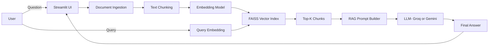

# Multi-Document Question Answering System using RAG

A Retrieval-Augmented Generation (RAG) based application that allows users to upload multiple documents (PDF, DOCX, CSV) and ask natural language questions.
The system retrieves the most relevant content using vector search (FAISS) and generates grounded answers using LLMs.


## 🌐 Live Demo

 **Try the App Live:**  
👉 [Hugging Face Spaces – Multi-Document RAG](https://huggingface.co/spaces/AlinaaaKhannn/rag_multi_document)


## 🚀 Features

- Upload multiple documents at once

- Supports PDF, DOCX, CSV

- Semantic search using Sentence Transformers + FAISS

- Retrieval-Augmented Generation (RAG) pipeline

- LLM routing between Groq (LLaMA 3) and Google Gemini

- Retrieval-only demo mode (LLM optional)

- Source-aware answers with document & chunk references

- Deployed on Hugging Face Spaces


## 🧠 RAG Architecture




## ⚙️ Tech Stack

- **Frontend:** Streamlit

- **Embeddings:** `sentence-transformers/all-MiniLM-L6-v2`

- **Vector DB:** FAISS

- **LLMs:**

     - **Groq** – `llama-3.1-8b-instant`

     - **Google Gemini** – `gemini-flash-latest`

- **Language:** Python


## ⚙️ Configuration

All configurations are centralized in `config.py.`

## Environment Variables

Create a `.env` file:

```bash
GEMINI_API_KEY=your_gemini_api_key
GROQ_API_KEY=your_groq_api_key
```

## 🛠 Installation & Setup (Local)

1️. Clone the repository
```bash
git clone https://github.com/AlinaKhan111/Multi-Document-Answering-using-RAG.git
cd Multi-Document-Answering-using-RAG
```

2️. Create virtual environment
```bash
python -m venv .venv
source .venv/bin/activate   
```

3️. Install dependencies
```bash
pip install -r requirements.txt
```

4️. Run the app
```bash
streamlit run app.py
```

##  How It Works

1. User uploads one or more documents.

2. Documents are converted into plain text.

3. Text is split into overlapping chunks.

4. Chunks are embedded and indexed using FAISS.

5. User query is embedded and matched against chunks.

6. Top-K relevant chunks are passed to the LLM.

7. LLM generates an answer only from retrieved context.


## 🎛 LLM Modes

- **Groq (LLaMA-3)** → Fast, cost-efficient

- **Gemini** → Strong reasoning

- **Retrieval-only mode** → Useful for demos and debugging


## 📚 Example Use Cases

- Academic notes Q&A

- Resume or policy document analysis

- Research paper exploration

- Multi-file knowledge assistant


## 🌐 Deployment (Hugging Face Spaces)

This project is deployed using Streamlit on **Hugging Face Spaces.**

**Notes:**

- Secrets are added via HF Spaces → Settings → Secrets

- Uses lightweight models for memory efficiency

- No code changes required for deployment


## 🚧 Limitations

- In-memory FAISS (no persistence)

- No OCR for scanned PDFs

- Single-user session (Streamlit default)


## 🔮 Future Improvements

- Persistent vector store (Chroma / Pinecone)

- Streaming responses

- OCR support for scanned PDFs

- Chat history & memory

- Authentication & access control


## 🧑‍💻 Skills Demonstrated

- Retrieval-Augmented Generation (RAG)

- Vector databases & semantic search

- LLM prompt engineering

- Multi-LLM orchestration

- Modular Python architecture

- Streamlit deployment

- Hugging Face Spaces